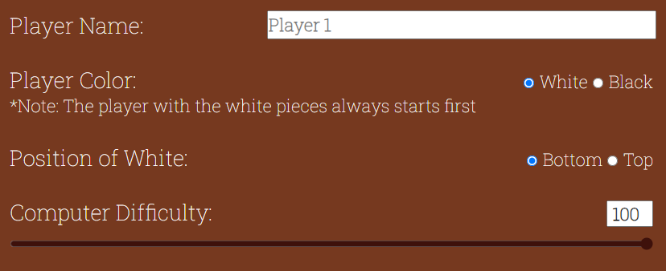

# Chess Champions

## Introduction

Chess Champions is a website where the user can play a game of chess the way they want against a friend or a computer of varying levels of difficulty. The aim of the site is to entertain the user with a game that is over 1500 years old.

The website is deployed to Github Pages and can be found here: <https://shanebyrne0963.github.io/chess-champions/>

## UI/UX Design

### Color Scheme

- The website has a simple and uniform color scheme, with all text colored white displayed on a brown shaded background
- The brown color is designed to resemble the outside chessboard, and gives the website a wood-like asthetic
- Some areas of the website have different shades of brown to add color diversity to the page

### Typography

- The website uses a single font, Roboto Slab, for its headings and normal text
- The use of a single font is to maintain font style consistency across the site
- This font was used because it is an easy to read serif font, with a style that represents the old-fashioned nature of the game well

### Wireframes

- For desktop screen sizes:
  - index.html
    - 
  - game.html
    - 
- For tablet screen sizes:
  - index.html structure remains the same as on desktop
  - game.html
    - 
- For mobile screen sizes:
  - index.html
    - 
  - game.html
    - 

## Features

### User Interface

- **Game Settings Page**
    - Upon entering the website, the user is greeted with an assortment of options that lets them customize their game experience.
    - The first setting is a select input requesting the type of players that will play the game. There are 3 different options:
        - Player versus Player
        - Player versus Computer
        - Computer versus Computer
    - 
    - This select input will change the rest of the inputs depending on what is selected. This is done so that settings that are only relevant to the type of players are shown to the user.
    - 
    - Below the dynamic settings There is a drop-down menu for advanced moves. These are hidden by default to prevent too much information being displayed on the screen on page load.
    - 
    - Centered at the bottom of the settings element, there is an anchor element that takes the user to the game, applying all the settings that have been inputted
    - If the user selected "Computer vs. Computer", the text for the anchor will change from "Play Game!" to "Watch Game!" as the user will not be interacting with the game on this setting
    - 

- **Game Page**
    -The game page is made up of several UI elements:
        - The chess board
        - The player turn heading
        - 2 player user interfaces
        - An announcements section
        - A game options section

### Content

## Testing

### Bugs

### Manual Testing

### Validator Testing

### Unfixed Bugs

## Deployment and Local Development

### Deploy on Github Pages

### Cloning Repositories

### Forking Repositories

## Credits

### Content

### Media
