# Chess Champions

## Introduction

Chess Champions is a website where the user can play a game of chess the way they want against a friend or a computer of varying levels of difficulty. The aim of the site is to entertain the user with a game that is over 1500 years old.

The website is deployed to Github Pages and can be found here: <https://shanebyrne0963.github.io/chess-champions/>

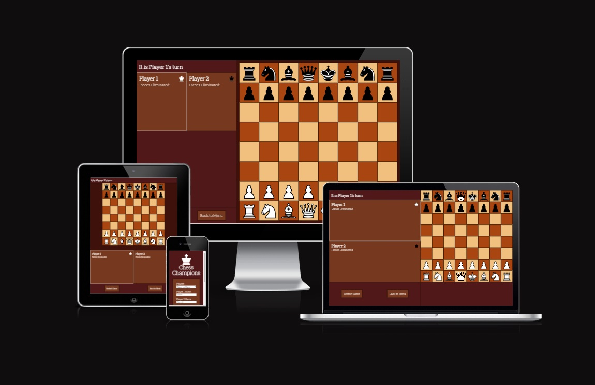

## UI/UX Design

### Color Scheme

- The website has a simple and uniform color scheme, with all text colored white displayed on a brown shaded background
- The brown color is designed to resemble the outside chessboard, and gives the website a wood-like asthetic
- Some areas of the website have different shades of brown to add color diversity to the page

### Typography

- The website uses a single font, Roboto Slab, for its headings and normal text
- The use of a single font is to maintain font style consistency across the site
- This font was used because it is an easy to read serif font, with a style that represents the old-fashioned nature of the game well

### Wireframes

- For desktop screen sizes:
    - index.html
        - 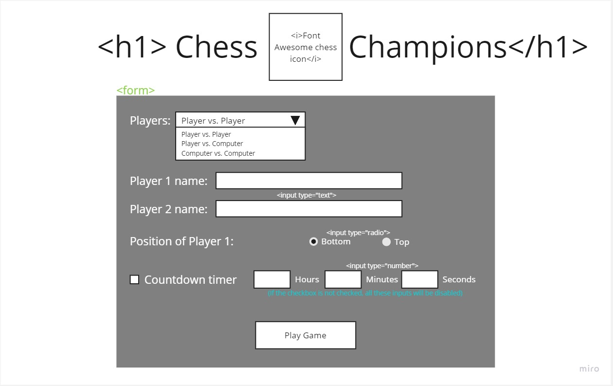
    - game.html
        - 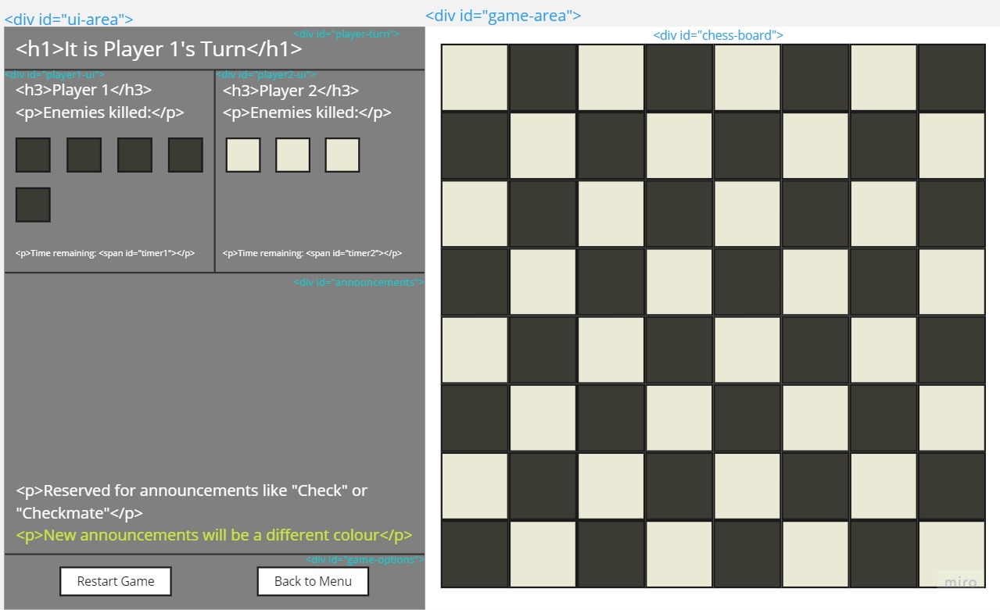
- For tablet screen sizes:
    - index.html structure remains the same as on desktop
    - game.html
        - 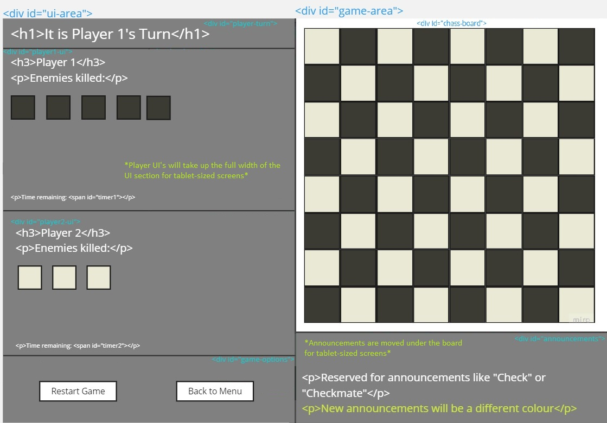
- For mobile screen sizes:
    - index.html
        - 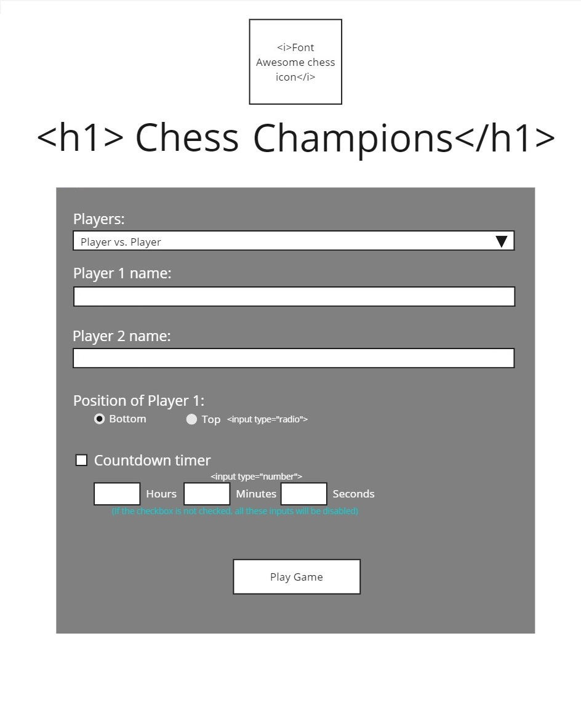
    - game.html
        - 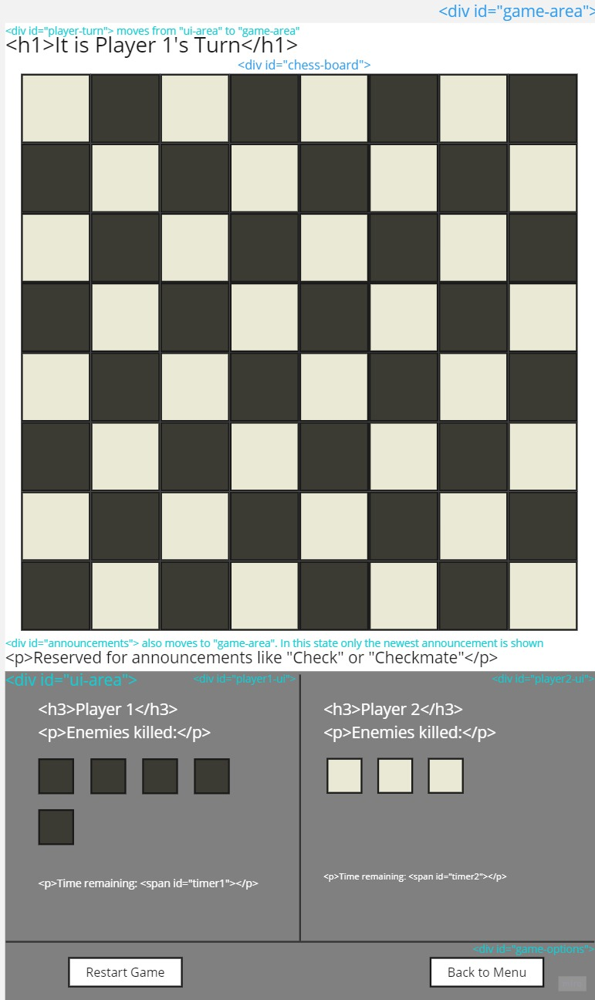

## Features

### Content

- **Game Settings Page**
    - The game settings page is the first page the user is presented with, and provides a wide range of settings for them to customize the game to their liking
    - The user can change the following:
        - Types of players playing the game (Player vs. Player, Player vs. Computer, Computer vs. Computer)
        - Each of the player names (Up to 2)
        - Which side the two different colors will start on
        - The color of the player (Player vs. Computer only)
        - An optional time limit with a minimum time of 30 seconds and a maximum time of 10 hours (Player vs. Player only)
        - The difficulty of the computer, with a range from 0 (easy) to 100 (hard)
        - If a pawn moving to the other side of the board can be promoted to any piece or if they can only bring back pieces removed from the board
        - If the castling move is allowed in the game
        - If the en passant move is allowed in the game
    - These settings are stored in localStorage so they will be remembered when the user returns to the site

- **Game Page**
    - On entering the game page, the game immediately starts, following the rules you would expect in a normal game of chess:
    - *Game Rules* ([Click here to get a more in-depth description](https://en.wikipedia.org/wiki/Rules_of_chess))
        - There are 6 different pieces present on the board: The pawn, knight, bishop, rook, queen and king, each with a different set of moves
        - Both players start with 8 pawns, 2 knights, 2 bishops, 2 rooks, 1 queen and 1 king
        - 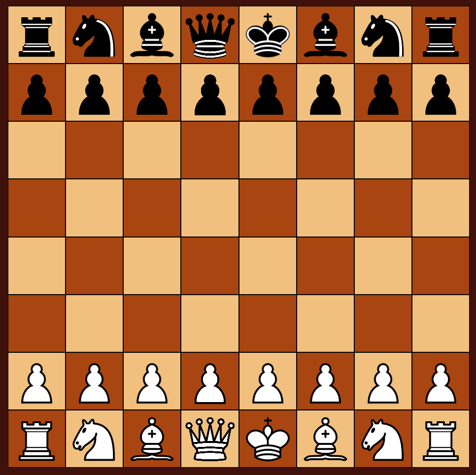
        - The aim of the game is to checkmate the opponent's king, leaving them with no other moves that will result in the king surviving
    - *Advanced Moves*
        - The game has support for the lesser known advanced moves ["Castling"](https://en.wikipedia.org/wiki/Castling) and ["En passant"](https://en.wikipedia.org/wiki/En_passant)
        - These moves are not known by everyone, and there is a chance the user may wish to play the game without these moves, which is why there are options to disable them
    - *Pawn Promotion*
        - If a pawn moves to the end of the board where its enemy started, it will be promoted to any piece other than a pawn or a king
        - When playing chess on a real board, players are limited to taking one of their pieces that was removed from the board. Some users may be accustomed to this, so there is an option to play the game with either of these rules
        - When this event happens to the user, a banner will appear over the board, giving the user clear instructions on how to promote their piece
    - *Check*
        - Check is called when a player's king is under threat if being attacked by an enemy piece on their turn
        - The user cannot make any moves that will not result in this attack being prevented
    - *Checkmate*
        - Checkmate is when a player's king is checked, and there are no other moves they can take to prevent this check
        - When this happens, the game will end, displaying a banner over the board announcing the winner of the game
        - The user can then click on one of the game options to start the game over or return to the game settings page
    - *Stalemate*
        - Stalemate is when a player has no moves to make that will not result in checking their king, but the king is not in check
        - When this happens, the game will end, displaying a banner over the board announcing the stalemate and that the game is a draw
    - *Time Limit*
        - If the game involves two users playing the game against each other, they have an option to include a time limit
        - Each player has their own time limit, which only counts down when it is their turn
        - The timer does not reset every turn
        - If the time counts down to 0, the game will end, and a banner will appear announcing the other player as the winner
        - This option is not available when there is a computer playing the game, because the computer only takes 1 second to make a move, making this timer redundant
    - *Chess Bot*
        - The user has an option to play against the computer, or watch 2 computers play against each other
        - If this option is selected, on the computer's turn, the user will not be able to select or move any of the pieces and one piece will automatically move, moving on to the next turn
        - The outcome of this automatic move depends on the difficulty, a setting the user can change in the game settings page
        - This difficulty is a number with a range from 0 to 100
        - At 0, the computer picks a move at random, taking nothing into consideration
        - At 100, the computer carefully evaluates the board and takes many factors into consideration:
            - If a move is unsafe for the chess piece, this move will be less likely to happen
            - If the move will leave their king exposed, this move will be less likely to happen
            - If an enemy piece can be eliminated, this move will be more likely to happen
            - If the move will surround the enemy king, this move will be more likely to happen
        - In between 0 and 100, thre will be a chance for these parameters into consideration when making the move. The higher the difficulty, the more likely they will be considered

### User Interface

- **Game Settings Page**
    - Upon entering the website, the user is greeted with an assortment of options that lets them customize their game experience.
    - The first setting is a select input requesting the type of players that will play the game. There are 3 different options:
        - Player versus Player
        - Player versus Computer
        - Computer versus Computer
    - 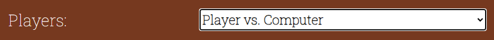
    - This select input will change the rest of the inputs depending on what is selected. This is done so that settings that are only relevant to the type of players are shown to the user.
    - 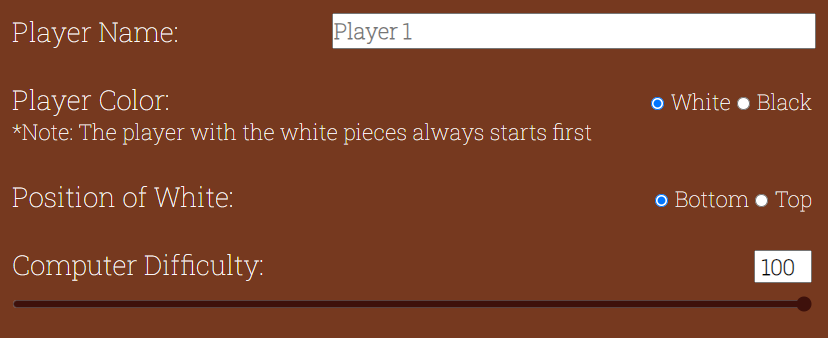
    - Below the dynamic settings There is a drop-down menu for advanced moves. These are hidden by default to prevent too much information being displayed on the screen on page load.
    - 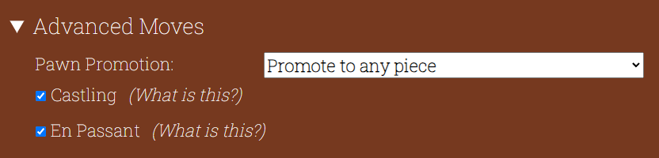
    - Centered at the bottom of the settings element, there is an anchor element that takes the user to the game, applying all the settings that have been inputted
    - If the user selected "Computer vs. Computer", the text for the anchor will change from "Play Game!" to "Watch Game!" as the user will not be interacting with the game on this setting
    - 
    - The game settings page gives the user a lot of control over how their game is played

- **Game Page**
    
    - The game page is made up of several UI elements:
        - The chess board
        - The player turn heading
        - 2 player user interfaces
        - An announcements section
        - A game options section
        - A banner over the chess board
    - 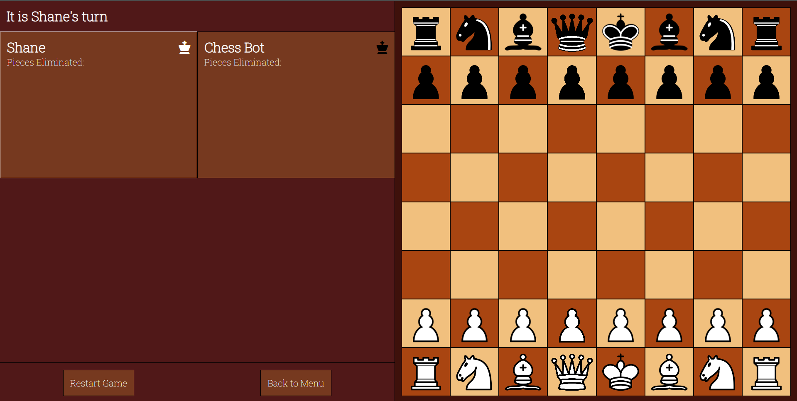
    - *Chess Board:*
        - This is where the main gameplay happens
        - The board is made up of an 8x8 grid of tiles
        - The user can interact with their pieces to select them when it is their turn, and can click on any tile the selected piece can move to
        - The possible moves are represented by icons that appear over the tile. There are different icons for different moves
    - 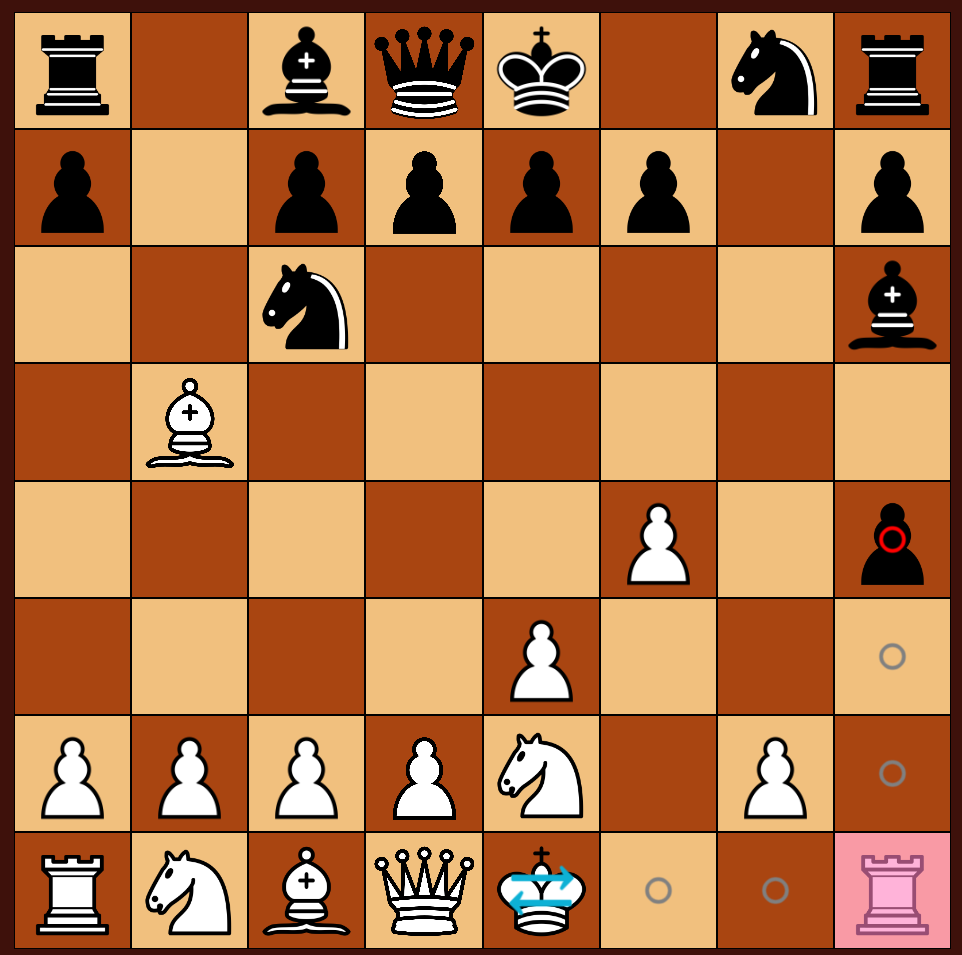
    - *Player Turn Heading*
        - Notifies the user which player is currently taking their turn
        - Always situated on the top-left corner of the screen, making it more likely for the user to notice it
    - 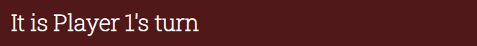
    - *Player User Interfaces*
        - Underneath the player turn heading are 2 player user interfaces side by side. For mobile screens they appear under the announcement
        - At the top of this UI, the player's name and their color represented by the king piece to the right of it is displayed
        - In the middle, there is an array of icons for each piece that player has eliminated
        - If a player's pawn reaches the other side of the board and has to pick an eliminated piece to promote to, the icons that the player can revive will begin to flash. This is done to draw attention to the user so they know what to click on
        - At the bottom of the UI, there is a clock icon with the amount of time the user has to make the move remaining. This feature is only available in player vs player, and if the user requested a time limit
        - If the UI belongs to the player that is taking their turn, the element will have a white outline, making it clearer whose turn it is
    - 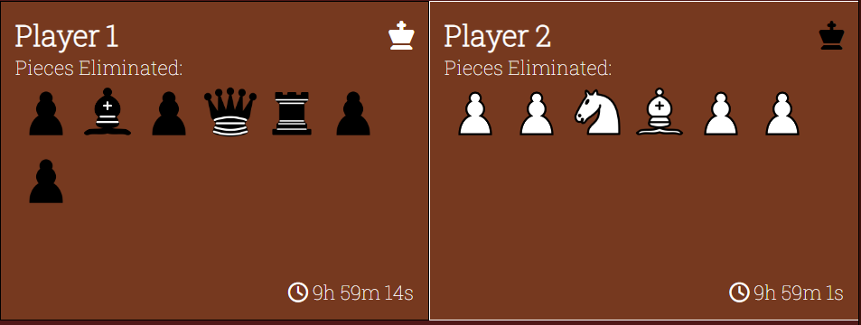
    - *Announcements*
        - Announcements appear under the player user interfaces for desktop and under the chess board for tablets and mobile phones
        - Each time an event happens, a new notification will appear at the bottom of the element, notifying the user of the event
        - The announcements will let the user know about a pawn elimination, check, checkmate or timeout
        - Any new announcements will be gold in color until the next turn, differentiating it from announcements that are less relevant
        - This part of the user interface is important because it informs the user about what is happening in the game, in case there is something they missed or did not notice
    - 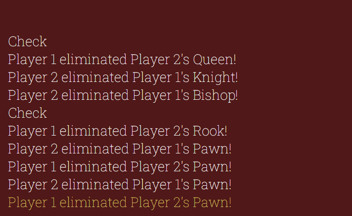
    - *Game Options*
        - Situated at the bottom of the user interface, this section consists of 2 buttons
        - The first button resets the game, clearing any changes and setting up the chess board. This button does not take the user to another page
        - The second button is an anchor that returns the user to the game settings page
        - This main purpose of this part of the UI is to allow the user to make changes to the game settings if they are not happy with them, or start the game over if desired
    - 
    - *Banner*
        - The banner displays a heading, subheading and sometimes a grid of icons over the chess board and is only visible when the game has paused or ended
        - This only happens when a player is promoting a pawn, on checkmate or if a player runs out of time
        - On pawn promotion, if the user has chosen to promote the pawn to any piece, 4 icons, the knight, the bishop, the rook and the queen, will appear under the text
        - The color of these icons depends on the color of the player that has activated the banner
        - On game end, the banner will disappear after 5 seconds to allow the user to see the board again, if they desire
        - Because the banner appears over the chess board, it is a very effective way of informing the player of the steps they need to take to continue the game, without leaving the user wondering what to do next
    - 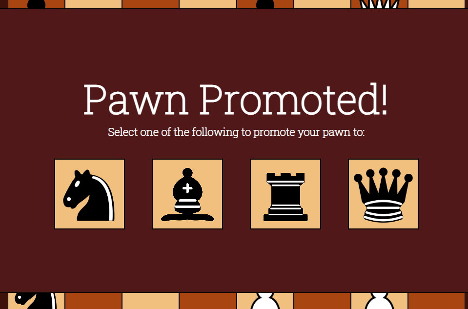

## Testing

### Bugs
- **Bug #1 (28/6/23) Chess pieces not rendering on board**
    - Expected result: Chess pieces to be visible on the board
	- Solution: Incorrect directory to locate the images. Used url("assets/images/chess-pieces/black-pawn.png"); in css file.
	Should have used url("../images/chess-pieces/black-pawn.png");

- **Bug #2 (29/6/23) Applied an onclick function to the document to deselect all tiles when the user clicks on something that's**
	not their chess piece. However it deselects everything even when a piece is clicked
	- Expected result: I wanted the document's onclick function to run first, deselecting everything first and then selecting
	the clicked tile, but JavaScript does not work that way
	- Solution: Approach the deselection in a different way: add onclick listeners for all tiles instead of just the
	player tiles, as well as adding a separate onclick listener for the UI div. This allows the deselect function to be called
	when the user clicks on certain points rather than call it every time the user clicks on the screen

- **Bug #3 (30/6/23) List of possible moves for AI is not added to the designated array**
	- Expected result: All of the possible moves should be added to the array
	- Solution: I used square brackets [] instead of parentheses () for the array.push() method

- **Bug #4 (1/7/23) Tile evaluation stops at empty space**
	- Expected result: Tile evaluation loop should stop when it encounters a piece
	- Solution: The loop ends when it encounters a piece with the same color. However it is comparing the color with the
	blank tile that's being evaluated, rather than the piece that's evaluating the tile. To fix this, add a second argument
	to tile.evaluate containing the information of the evaluating tile

- **Bug #5 (1/7/23) Pawn threats are sometimes ignored and AI pieces move into positions where they can be destroyed**
	- Expected result: The AI should take all pawns into consideration when making a move
	- Solution: The AI only checked the 'pawn' piece name. This check wouldn't count for 'pawnNew' pieces that haven't made
	a move yet. To fix this, instead of checking if the piece name equals 'pawn', check if the string.includes('pawn')

- **Bug #6 (1/7/23) Sometimes the AI moves pieces into dangerous positions**
	- Expected result: The AI shouldn't move into a vulnerable position unless it is guarded by another piece
	- Solution: The piece was including itself before the move as a guard. To fix this just ignore the tile if it's the
	same as the original position

- **Bug #7 (2/7/23) Knight is putting itself in a vulnerable position to attack a Pawn**
	- Expected result: The AI shouldn't move into a vulnerable position unless it is guarded by another piece
	- Solution: The Knight was eliminating a Pawn and putting the king in check. Those scores (eliminating Pawn: 100 and
	targeting King: 200) were summing up to be equal to the Knight's value of 300, so it thought sacrificing itself for
	a check and a Pawn kill was worth it. To fix this, bring down the value of the King from 2000 to 1500
	-> This wasn't the best solution, because if there are a lot of targets within that tile the total score will go above
		300 anyway. A better solution would be for the AI to only take targets into consideration if the tile is safe

- **Bug #8 (4/7/23) When the computer is to make the first move, it doesn't move**
	- Expected result: The ai should run through the function as normal when first
	- Solution: The calculations script file is loaded last, so the game script is calling the calculations script before
	it is even loaded. Move the calculations file above the game file in the html to fix

- **Bug #9 (4/7/23) Some tiles have the 'clickable' class in their class list multiple times**
	- Expected result: Every element in the entire DOM should only have the 'clickable' at most once
	- Solution: The 'possible-move' tiles were not removing their clickable class when deleted. Add code to remove the class
	in deselectAll to fix this

- **Bug #10 (4/7/23) Pieces cannot be clicked on once they make a move**
    - Expected result: Any friendly piece can move once it is the player's turn
    - Solution: the deselectAll fix above removes the class after the piece makes a move. Since I moved the nextTurn function into the tile.move function, deselectAll is called after the ai makes a move. To fix this, call deselectAll before tile.move

- **Bug #11 (4/7/23) When a player makes a move, only some pieces have their interaction taken away**
	- Expected result: When the player makes a move, all interaction should be taken away until it is their turn again or
	they have selected a piece from the graveyard to revive
	- Solution: To deselect, I was looping through an array containing all the elements with the 'clickable' class, then
	removing the ones that also have the 'tile' class. However, when I removed the 'clickable' class, it was also getting
	removed from the array, so the loop was skipping over some elements. To fix this, only increment through the loop if
	the element with the 'clickable' class does NOT also have the 'tile' class

- **Bug #12 (5/7/23) Some valid moves are not permitted when preventing a check**
	- Expected result: Any valid move should be able to be taken
	- Solution: The variable for checking if a move is valid is set outside the loop, and does not reset each iteration
	like it should. That means that once an invalid tile is found, then all other tiles will be declared as invalid for that
	move. To fix, move the variable declaration inside the loop

- **Bug #13 (6/7/23) Animation piece not setting the size or position**
	- Expected result: The animation should have the same size and position as the starting tile
	- Solution: Include "px" at the end of the css style strings when setting them

- **Bug #14 (11/7/23) Pawns are seen as unable to attack in the ai tile evaluation**
	- Expected result: Pawns should be seen as threats by pieces in their sights, and pawns should be able to attack other pieces
	- Solution: The pawn can only attack one space diagonal to them. The loop gets this space by moving in a diagonal direction and
	checking the first tile in the loop. However, the loop starts at the tile itself, instead of the first tile in the diagonal
	directions. To fix this, add the vector to the coordinates before checking if a pawn is there

- **Bug #15 (12/7/23) Checkmate is called even though there are pieces that can prevent it**
	- Expected result: If there are moves the player can take, the game should still continue
	- Solution: evaluateTileWithMove was not working because I was setting the parent node of the chess piece to move it to
	another tile. tile.appendChild seemed to fix this problem

- **Bug #16 (12/7/23) Multiple pieces moving at the same time when the game is restarted**
	- Expected result: On game restart, the animations should play one by one
	- Solution: Clear the timeout for the ai waiting to make a move when the game resets

- **Bug #17 (16/7/23) Castling move turns into a vector move after first use**
	- Expected result: The piece moves should never change
	- Solution: When passing the move into evaluateTileVector, I was changing the rule from 'first-castle' to 'vector', thinking
	that passing an array into a function creates a copy of an array. However, instead it creates a reference to that array. To fix,
	create a new array inside the function and assign the move elements to it, except the ones I want to change

- **Bug #18 (17/7/23) Pawns will put themselves in vulnerable positions to attack other pawns**
	- Expected Result: Pawns should be more cautious of their moves
	- Solution: If moving to a tile is considered to be a bad move, then the score was being subtracted based on where the pawn was before
	the move, instead of after. This may have caused insufficient point reduction to deter the pawn from moving there. To fix,
	subtract the score based on the tile the pawn will move to

- **Bug #19 (21/7/23) Sometimes enemy pieces can be clicked on and moved by the player**
	- Expected result: The player should only be able to interact with their own pieces
	- Solution:
        - When the player clicks on an empty tile the piece cannot move to, all tiles will be deselected.
        - This involves removing the interaction from all empty tiles, but leaving the interaction on pieces so the player can click on them again.
        - However, the logic did not consider if the piece with the interaction was an enemy piece, which occurs when a piece can attack an enemy.
        - This meant that when the deselect tile function was called, the enemy that could be attacked kept it's interaction and was treated like a player piece when clicked on afterwards.
        - To fix, remove the interaction from the piece if the its color does not match the current turn's color

- **Bug #20 (23/7/23) Sometimes player pieces cannot be selected on the player turn**
	- Expected result: When it is the player's turn, they should be able to select any of their pieces
	- Solution: If the player clicks on the button to restart the game while a piece is selected, the possible move elements aren't
	properly deleted, and there is no attempt to delete them on game restart. To fix this, deselect all tiles when the game starts/restarts

- **Bug #21 (23/7/23) On very rare occasions, the game stops before checkmate or timeout**
	- Expected result: The game should continue until checkmate or a player's time runs out
	- Solution: What happened was a stalemate, i.e. when there is no legal moves for the player to take but they are not in check. The
	code did not have an if statement for this happening, so put one in to fix it.

### Manual Testing

- **Form Inputs**
    - Any player name input, checkbox or number input displayed on the menu settings page is required and the form will not submit unless they are filled out
    - If the player names are more than 10 characters long, an alert will appear telling the user the name has to be smaller and remove the value
    - If 
- **User Interaction**
- **Anchors and Buttons**
- **Media Queries**
- **Other Browsers**

### Validator Testing

- All HTML files have been passed through the W3C Markup Validator and produced no issues

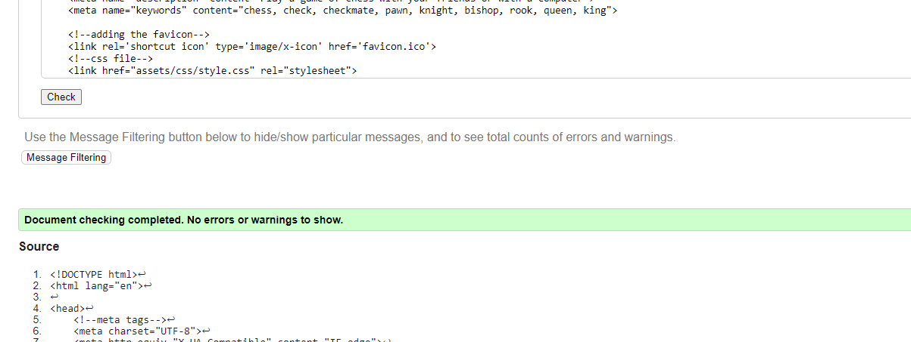

- All CSS files have been passed through the Jigsaw W3C Validator and produced no issues

- All Javascript files have been passed through the JsHint Validator and produced no warnings

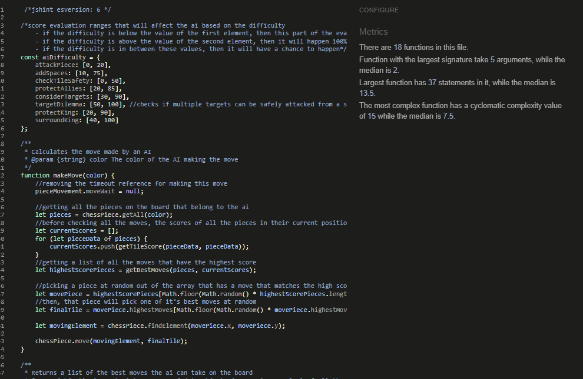

- All background colors have been tested against the website's white font for contrast and each one passed

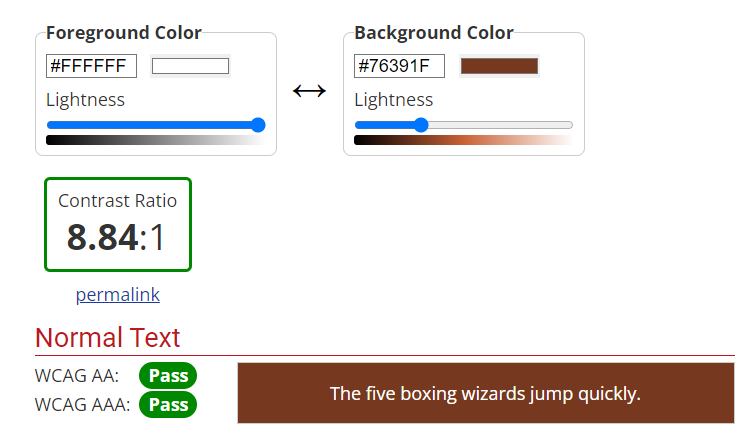

- Each page has been tested using the Lighthouse developer tool and produced high results

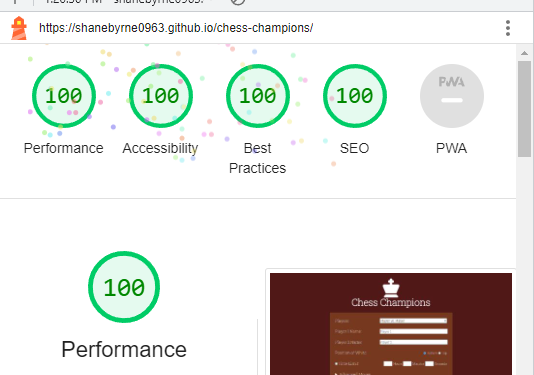

### Unfixed Bugs

No unfixed bugs

## Deployment and Local Development

### Deploy on Github Pages

- The site has been successfully deployed to GitHub Pages. The steps to deploy are as follows:
  - In the GitHub repository, navigate to the Settings tab.
  - In the Pages tab, from the source drop-down menu, select "Deploy from a branch".
  - Under the Branch heading, ensure the first drop-down menu has "main" selected and click the "Save" button to the right of it.
  - Wait a few minutes and refresh the page. The link will appear under the GitHub Pages heading.
- The live site can be visited [here](https://shanebyrne0963.github.io/chess-champions/).

### Cloning Repositories

- The site was cloned onto my desktop. The steps to clone are as follows:
  - In the GitHub repository, click on the green button that says "Code". A drop-down menu will appear.
  - In the "Local" tab of the drop-down, there will be a link under the "HTTPS" section. Click the copy button to the right of the link.
  - In the search bar of your PC desktop, search for terminal and open.
  - Type the following command: `git clone https://github.com/ShaneByrne0963/chess-champions.git`.
  - The site will be cloned to your desktop.

### Forking Repositories

- The site was created using a forked repository created by Code Institute. This repository can be found [here](https://github.com/Code-Institute-Org/ci-full-template).
- The steps to fork are as follows:
  - Navigate to the page of the repository you wish to fork.
  - Click on the green button that says "Use this template". A drop-down will appear underneath, and select "create a new repository"
  - Enter a repository name where specified.
  - Ensure the site is set to public
  - Click "Create repository from template". Codeanywhere will begin to build a new project from that template.

## Credits

### Content

- [Local storage tutorial](https://developer.mozilla.org/en-US/docs/Web/API/Window/localStorage)
- [Session storage tutorial](https://developer.mozilla.org/en-US/docs/Web/API/Window/sessionStorage)
- [Animate element movement](https://www.w3schools.com/howto/howto_js_animate.asp)
- [Getting the position of an element](https://stackoverflow.com/questions/442404/retrieve-the-position-x-y-of-an-html-element)
- [Window resize event](https://stackoverflow.com/questions/641857/javascript-window-resize-event)
- [CSS aspect-ratio attribute](https://developer.mozilla.org/en-US/docs/Web/CSS/aspect-ratio)
- [CSS calc() function](//developer.mozilla.org/en-US/docs/Web/CSS/calc)
- [CSS repeat() function](//css-tricks.com/snippets/css/complete-guide-grid/)
- [Change properties of range input](https://nikitahl.com/style-range-input-css#:~:text=One%20simple%20way%20to%20customize,of%20the%20track%20and%20thumb.)
- [Prevent the enter key from submitting a form](https://stackdiary.com/tutorials/prevent-form-submission-on-pressing-enter-with-javascript/)

### Media

- [Chess Piece Images](https://commons.wikimedia.org/wiki/Category:SVG_chess_pieces)